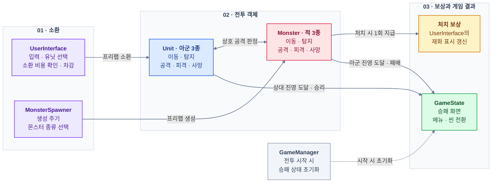

# Unity 2D Rumble Heores — C# · Unity 개인 프로젝트

**Unity와 C#**으로 개발한 **Rumble Heores** 이름의 **개인 창작 2D 타워 디펜스 게임**입니다. 재화로 아군을 소환하고, 자동으로 전진하는 유닛의 전투와 몬스터 처치 보상을 통해 병력을 운영하며 상대 진영 돌파를 목표로 합니다.
**컴포넌트·프리팹 기반 게임 구성**부터 **자동 전투·타격 판정**, **재화·소환**, **튜토리얼·스테이지 진행**, **UI·애니메이션 연동**까지 구현했습니다.
## [GitHub Repository](https://github.com/Nu-LungJi/Unity2D_Personal_Project)
## [게임 시연 영상 (Demo Video)](https://youtu.be/J_bWPzjMYHE)

| 항목     | 내용                                                       |
| ------ | -------------------------------------------------------- |
| 개발 기간  | 2025.03.31 ~ 2025.04.27 (4주)                             |
| 개발 인원  | 1인 — 전체 프로그래밍 담당                                         |
| 플랫폼    | Windows PC / x64                                         |
| 장르     | 2D 타워 디펜스                                                |
| 플레이 구성 | 유닛 소환 → 자동 전투 → 처치 보상 → 병력 추가 → 상대 진영 돌파                 |
| 사용 기술  | C# · Unity · URP 2D · Physics2D · Animator · TextMeshPro |

## 주요 기술 구현

| 번호    | 기술                    | 핵심 구현                                    |
| ----- | --------------------- | ---------------------------------------- |
| **1** | **컴포넌트·프리팹 기반 구성**    | 전투·소환·UI·게임 결과 역할 분리, 아군·몬스터 각 3종 프리팹 구성 |
| **2** | **자동 전투·애니메이션 타격 판정** | 레이어 기반 적 탐지, 이동·공격 전환, 공격 진행률에 따른 판정 활성화 |
| **3** | **재화 기반 유닛 소환**       | 유닛 선택, 비용 검사·차감, 프리팹 생성, 잔액 부족 안내        |
| **4** | **몬스터 생성·처치 보상**      | 주기적 생성, 난수 구간별 종류 선택, 사망 시 재화의 중복 지급 방지  |
| **5** | **튜토리얼·스테이지 진행**      | 3단계 안내, 5개 전투 스테이지, 진영 도달에 따른 승패·씬 전환    |
| **6** | **입력·전투 UI**          | 클릭 판정, Tab 소환 패널, 체력·재화·보상 표시            |
| **7** | **스프라이트·결과 화면 연출**    | 사망 페이드, 보상 텍스트 이동, 승패 화면·메뉴 표시           |

### 1. Unity 컴포넌트와 프리팹 기반 게임 구성

`MonoBehaviour`를 기반으로 **전투 객체·소환·인터페이스·게임 결과의 역할을 분리**했습니다. `Start()`에서 컴포넌트 참조와 초기값을 준비하고, `Update()`에서 입력·전투 상태·화면 표시를 갱신합니다.

- **전투 객체:** `Unit`과 `Monster`가 이동·탐지·공격·피격·사망을 처리합니다.
- **생성·소환:** `MonsterSpawner`는 몬스터를 반복 생성하고, `UserInterface`는 유닛 구매와 재화를 관리합니다.
- **게임 진행:** `GameState`는 승패 화면과 씬 전환을, `GameManager`는 전투 시작 시 승패 상태 초기화를 담당합니다.
- **프리팹 구성:** 아군·몬스터를 각각 3종으로 구성하고, Animator·SpriteRenderer·Collider2D·Rigidbody2D·체력 표시용 Canvas를 연결합니다. 종류별 체력과 탐지 레이어는 Inspector에서 설정합니다.

아래는 소환·전투·결과 처리 사이의 주요 연결 관계입니다.

관련 코드: `Unit.cs` · `Monster.cs` · `MonsterSpawner.cs` · `UserInterface.cs` · `GameState.cs` · `GameManager.cs`

### 2. Physics2D 자동 전투와 Animator 타격 판정

**적 탐지는 교전 시작 조건**, **공격 범위의 충돌은 실제 피해 조건**으로 구분했습니다. 아군과 몬스터는 서로 반대 방향으로 전진하다가, `Physics2D.OverlapCircle`과 `LayerMask`로 상대를 탐지하면 이동을 멈추고 공격합니다.

- **이동·공격 전환:** `Transform.Translate`와 `Time.deltaTime`으로 이동하고, 탐지 결과에 따라 이동 속도와 Animator의 `Attack` 파라미터를 변경합니다.
- **타격 시점:** `normalizedTime`에서 현재 반복의 진행률을 구하고, **50% 초과·80% 미만 구간**에 공격 범위 `ATTRange`를 활성화합니다.
- **피해 적용:** `OnTriggerEnter2D`에서 상대 공격 범위의 이름을 확인해 종류별 피해량을 적용합니다.
- **사망 전환:** 피해 이후 체력 표시를 갱신하고, 체력이 소진되면 생존 상태와 `Death` 파라미터를 변경합니다.

관련 코드: `Unit.cs` · `Monster.cs`

### 3. 재화 기반 유닛 소환

소환 UI에서 유닛을 선택하면 **보유 재화 검사 → 프리팹 생성 → 비용 차감 → 재화 표시 갱신**으로 구매를 처리합니다. 아군 3종은 소환 비용·체력·피해량을 다르게 설정해 병력을 선택할 수 있도록 구성했습니다.

- **유닛 생성:** 구매 가능한 경우 `Instantiate`로 선택한 프리팹을 아군 스폰 위치에 생성합니다.
- **잔액 부족:** 재화가 부족하면 안내 UI오브젝트를 표시하고, Fade Out 시키도록 만들었습니다.
- **초기화:** 전투 씬에 진입할 때 시작 재화를 다시 초기화합니다.

관련 코드: `UserInterface.cs`

### 4. 주기적 몬스터 생성과 처치 보상

`MonsterSpawner`에서 프리팹 배열을 관리하고, `InvokeRepeating`으로 **게임 시작 2초 후부터 7초 간격**으로 몬스터를 생성합니다. 난수 구간별로 종류를 선택해 기본 몬스터가 자주, 체력·피해량이 높은 몬스터가 적게 등장하도록 구성했습니다.

- **공통 행동·개별 수치:** 종류별 체력은 프리팹에 저장하고, 생성된 몬스터는 공통 `Monster` 스크립트로 탐지·전투·보상을 처리합니다.
- **처치 보상:** 사망 시 `Random.Range(10, 30)`으로 10~29의 재화를 지급합니다.
- **중복 지급 방지:** 몬스터별 `DO_ONCE` 플래그로 사망 처리 구간의 보상을 한 번만 지급하고, 사망 연출 이후 `Destroy`로 제거합니다.

관련 코드: `MonsterSpawner.cs` · `Monster.cs`

### 5. 튜토리얼과 스테이지 진행

**Title(Lobby) → 3단계 튜토리얼 → 5개 전투 스테이지**로 플레이 흐름을 구성했습니다. `TutorialManager`는 현재 순서의 안내만 표시하고, 마지막 안내 이후 첫 전투 씬으로 이동합니다.

- **승패 판정:** 아군이 상대 진영 기준 좌표에 도달하면 승리, 몬스터가 아군 진영에 도달하면 패배 상태를 설정합니다.
- **다음 스테이지:** 승리 화면에서 다음 전투 씬을 불러오며, 마지막 스테이지 이후에는 타이틀로 돌아갑니다.
- **재시작:** 패배 후 재시작은 첫 전투 스테이지로 연결합니다.
- **상태 초기화:** 전투 씬 진입 시 `GameManager`가 승리·패배 플래그를 초기화합니다.

결과 화면과 메뉴 선택은 `GameState`에서 처리하고, `SceneManager.LoadScene`으로 다음 화면을 연결합니다.

관련 코드: `GameState.cs` · `GameManager.cs` · `Tutorial Manager.cs`

### 6. 마우스 입력과 전투 UI

마우스 위치를 `Camera.main.ScreenToWorldPoint`로 변환하고, `Physics2D.Raycast`로 선택한 Collider를 확인합니다. 오브젝트 이름에 따라 유닛 구매·튜토리얼 진행·결과 메뉴를 처리합니다.

| UI | 구현 내용 |
| --- | --- |
| **소환 패널** | Tab 누름·해제에 따라 패널을 이동하고 안내 표시 전환 |
| **체력바** | 현재·최대 체력 비율에 따라 너비와 위치 갱신 |
| **보유 재화** | `TMP_Text`에 소환 비용 차감과 보상 지급 결과 반영 |
| **처치 보상** | `TextMeshProUGUI`로 획득량 표시, 보상 Canvas 활성화 |
| **잔액 부족 안내** | 안내 스프라이트를 표시한 뒤 페이드 처리 |

관련 코드: `UserInterface.cs` · `Unit.cs` · `Monster.cs` · `GameState.cs`

### 7. 스프라이트와 결과 화면 연출

**URP 2D Renderer·SpriteRenderer·Animator**로 캐릭터와 화면을 구성하고, 시간에 따라 투명도·위치를 변경해 전투 결과를 표현했습니다.

- **사망 연출:** 몸체 Collider를 비활성화하고, 약 1초 동안 스프라이트를 페이드한 뒤 객체를 제거합니다.
- **보상 연출:** 보상 Canvas를 짧게 위아래로 이동시켜 획득한 재화를 강조합니다.
- **승패 화면:** 배경을 페이드하고 일정 시간 이후 결과 메뉴와 승리 표시를 나타냅니다.

관련 코드: `Unit.cs` · `Monster.cs` · `GameState.cs`

## 개발 환경

| 분류 | 기술 |
| --- | --- |
| 게임 엔진 | Unity 6 · 6000.0.46f1 — 현재 프로젝트 설정 기준 |
| 언어 | C# |
| 렌더링 | URP 17.0.4 · 2D Renderer · SpriteRenderer |
| 물리·애니메이션 | Physics2D · Collider2D · Rigidbody2D · Animator |
| UI·입력 | uGUI · TextMeshPro · UnityEngine.Input |
| 객체·씬 관리 | Prefab · Instantiate / Destroy · SceneManager |
| 버전 관리 | Git |
